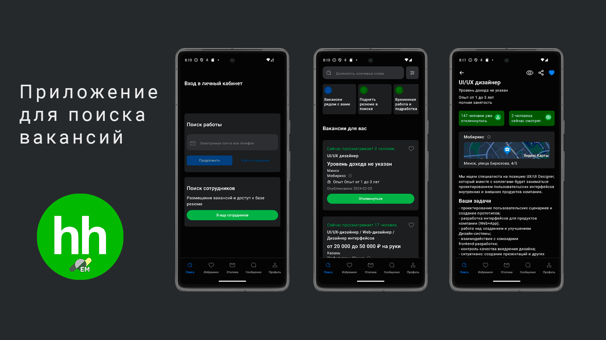
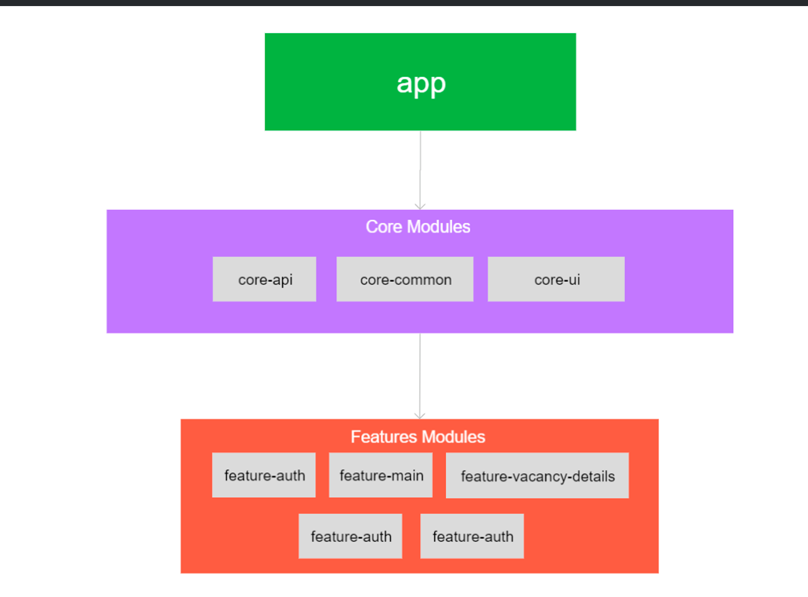

<h1 align="center">Effective HH</h1>

Тестовое задание для разработчика. Приложение для поиска вакансий

## Содержание

- [Описание](#описание)
- [Стэк](#стэк)
- [Модульность](#Модульность)
- [Функции](#функции)

## Описание

Проект разрабатывает мобильное приложение для поиска работы, которое включает функции навигации, просмотра и отклика на вакансии, а также возможность добавлять вакансии в избранное. Приложение использует Kotlin, корутины и MVVM архитектуру для обеспечения эффективной работы и масштабируемости.

## Стэк

- Kotlin
- Jetpack Compose
- Retrofit
- Coroutines
- Flow
- Dagger
- MVVM
- Многомодульность
- Clean Architecture

## Модульность

- **Модульность**: Архитектура разделена на core-модули (core-api, core-common, core-ui) и feature-модули (feature-auth, feature-bottom-nav-bar, feature-main, feature-navigation, feature-vacancy-details), что обеспечивает повторное использование кода и упрощает поддержку.
- **Связи между модулями**: Feature-модули зависят от core-модулей, что способствует инверсии зависимости и улучшает тестируемость. App-модуль связывает все модули, координируя их работу.
- **Преимуества**: Высокий уровень модульности и повторного использования кода. Поддержка тестируемости благодаря независимости модулей.
- **Потенциальные улучшения**: Оптимизация зависимостей: удаление ненужных зависимостей между модулями. Централизация навигации для улучшения управления навигационными потоками. 

## Функции

1. Поиск вакансий: Позволяет пользователям искать вакансии по ключевым словам и фильтрам, отображая результаты в виде списка с подробной информацией о каждой вакансии.

2. Отклики на вакансии: Пользователи могут откликаться на интересующие вакансии, отправляя свои данные и сопроводительные письма через модальные окна приложения.

3. Избранное: Вакансии можно добавлять в раздел избранного для быстрого доступа и отслеживания интересных предложений.

4. Авторизация пользователей: Приложение поддерживает вход в личный кабинет как для соискателей, так и для работодателей, используя проверку email и кода подтверждения.

5. Просмотр деталей вакансии: Пользователи могут просматривать подробную информацию о вакансии, включая требования, обязанности, информацию о компании и возможности задать вопросы работодателю.

